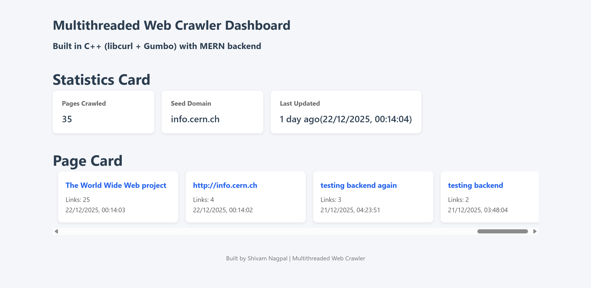

# Multithreaded Web Crawler Dashboard
C++ web crawler (libcurl + Gumbo) with a MERN backend and a React dashboard.

- Crawler: multithreaded, domain-restricted, depth-limited, deduped frontier.
- Backend: Node.js/Express + MongoDB, idempotent upsert for pages.
- Frontend: React dashboard to view stats and recent pages.

## Screenshots
Dashboard 

## Repository layout
- crawler/ — C++ crawler (libcurl, gumbo-parser, nlohmann::json)
- backend/ — Express API + Mongoose models
- frontend/ — React dashboard (Vite or CRA)

## Features
- Multi-threaded crawling using std::thread
- Max pages and max depth guards
- Same-domain restriction
- HTML parsing with Gumbo (title + links)
- Sends JSON to backend; backend upserts into MongoDB
- Dashboard shows recent pages, counts, timestamps

## Prerequisites
- Linux (tested on Ubuntu/Debian)
- Node.js 18+ and npm
- MongoDB (local or Atlas)
- C++ toolchain + deps:
  - build-essential, cmake
  - libcurl4-openssl-dev
  - libgumbo-dev
  - nlohmann-json3-dev

Install build deps (Ubuntu):
```bash
sudo apt-get update
sudo apt-get install -y build-essential cmake libcurl4-openssl-dev libgumbo-dev nlohmann-json3-dev
```

## Backend setup
```bash
cd backend
npm install
# Configure Mongo (local) or Atlas
export MONGODB_URI="mongodb://localhost:27017/webcrawler"
export PORT=5000
npm start
```

API routes (default):
- POST /api/pages — upsert a page document
  - body: { url: string, title: string, links: string[] }
- GET /api/pages — latest 50 pages (url, title, linksCount, createdAt)

## Frontend setup
```bash
cd frontend
npm install
# Vite:
npm run dev
# or CRA:
# npm start
```

## Crawler build and run
```bash
cd crawler
mkdir -p build && cd build
cmake ..
make -j
```

Run the crawler (backend must be running)

Crawler behavior:
- Uses Seed URL to start Crawling.
- Visits pages within the allowed domain up to MAX_DEPTH and MAX_PAGES.
- Parses title and links, dedupes, and POSTs to /api/pages.

## Configuration
Key constants live in crawler/src/Crawler.cpp:
- MAX_PAGES (default 200)
- MAX_DEPTH (default 3)
- ALLOWED_DOMAIN (default info.cern.ch)

Backend ports and DB:
- PORT (default 5000)
- MONGODB_URI

## Troubleshooting
- Backend unreachable: ensure PORT=5000 and no firewall blocks; verify curl http://localhost:5000/api/pages
- Missing libs: install libcurl4-openssl-dev, libgumbo-dev, nlohmann-json3-dev
- Invalid seed: backend /api/url returns 404 until you POST a valid seed from the UI
- Mongo errors: check MONGODB_URI and that mongod is running

## License
MIT
